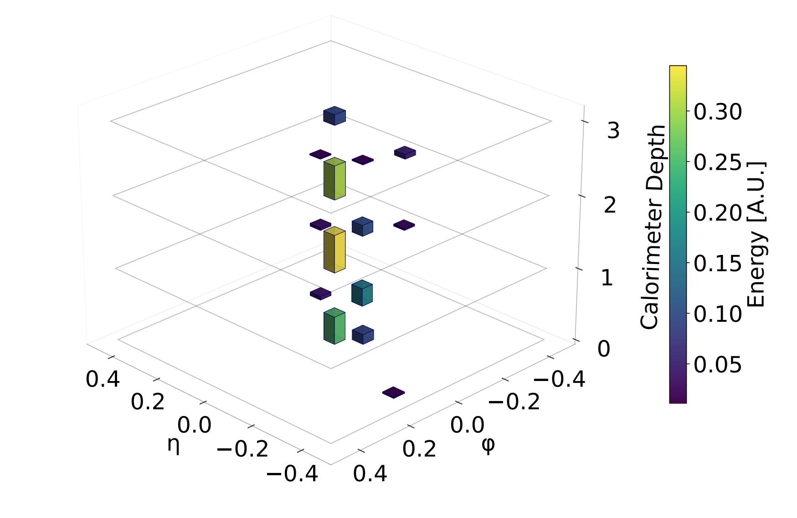
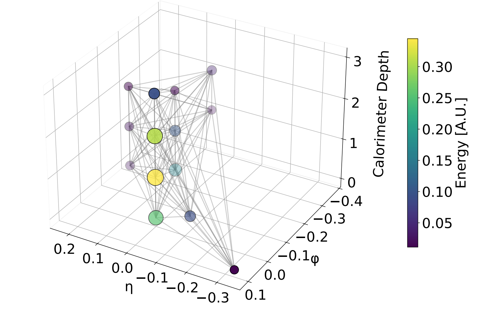

## Dark Photon dataset
Manipulate dark photon calorimeter deposits via graphs.

## TL;DR
The dataset is encoded as a Pytorch Geometric Dataset, allows you to download a dataset of graphs representing collisions.

```python
from darkphotondataset import DarkPhotonDataset
from transforms import GraphFilter

graph_filter = GraphFilter(min_num_nodes=2)
dataset = DarkPhotonDataset(
    root=dataset_root,
    subset=1.0,
    url="https://cernbox.cern.ch/s/PYurUUzcNdXEGpz/download",
    pre_filter=graph_filter,
    verbose=True
)
```
Here some visualization of the datas (both as images and graphs)
<div style="display: flex; gap: 16px; align-items: flex-start;">
  
  
</div>

Implementation of various graph model can be found at [this link](https://github.com/DonatellaGenovese/Transformer-for-DarkPhoton-Identification)
